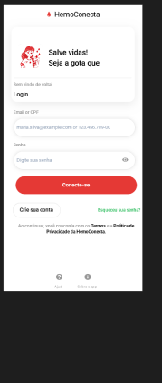
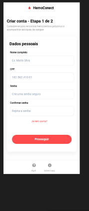
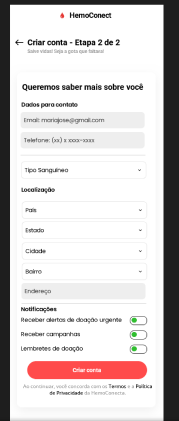
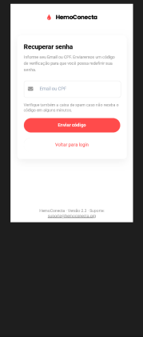
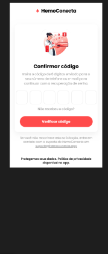
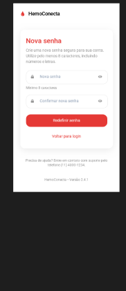

# HemoConecta

Aplicativo mobile desenvolvido em React Native com Expo para conectar doadores
de sangue a hemocentros, facilitando o acompanhamento de estoques e o
recebimento de alertas de doação urgente.

## Integrantes do grupo

- João Marcos Cariri Santos

## Link do projeto no Figma

[HemoConecta - Figma](https://www.figma.com/design/7IqJhjlkziqpiPWOhJ5RJU/HemoConecta?node-id=0-1&t=iuMGEor0H5n9sNq5-1)

## Telas implementadas

### Login

Tela inicial de autenticação, com campos de email/CPF e senha.



### Criar conta - Etapa 1 de 2

Primeira etapa do cadastro, com os dados pessoais do usuário (nome, CPF e senha).



### Criar conta - Etapa 2 de 2

Segunda etapa do cadastro, com dados de contato, localização, tipo sanguíneo
e preferências de notificação.



### Recuperar senha

Tela inicial do fluxo de recuperação de senha, onde o usuário informa email
ou CPF para receber o código de verificação.



### Confirmar código

Tela de inserção do código de 6 dígitos enviado por email ou telefone.



### Nova senha

Tela final do fluxo de recuperação, onde o usuário define e confirma a nova senha.



## Tecnologias utilizadas

- React Native
- Expo / Expo Router
- TypeScript

## Como executar o projeto

```bash
npm install --legacy-peer-deps
npx expo start
```

Escaneie o QR code exibido no terminal com o aplicativo **Expo Go**
(Android) ou a Câmera (iOS) para abrir o projeto no celular.